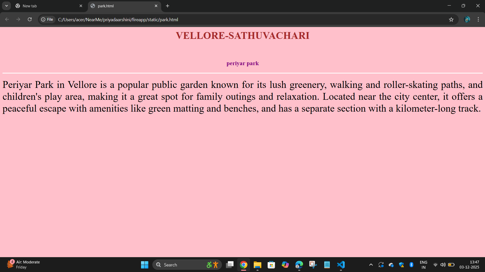
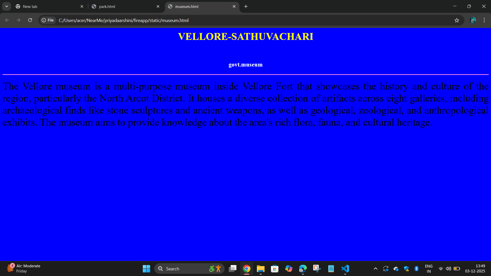
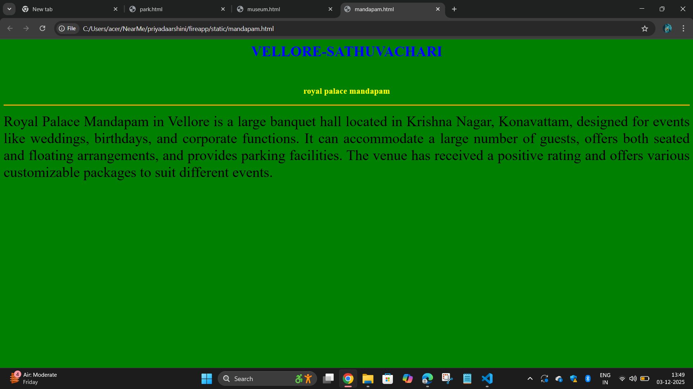
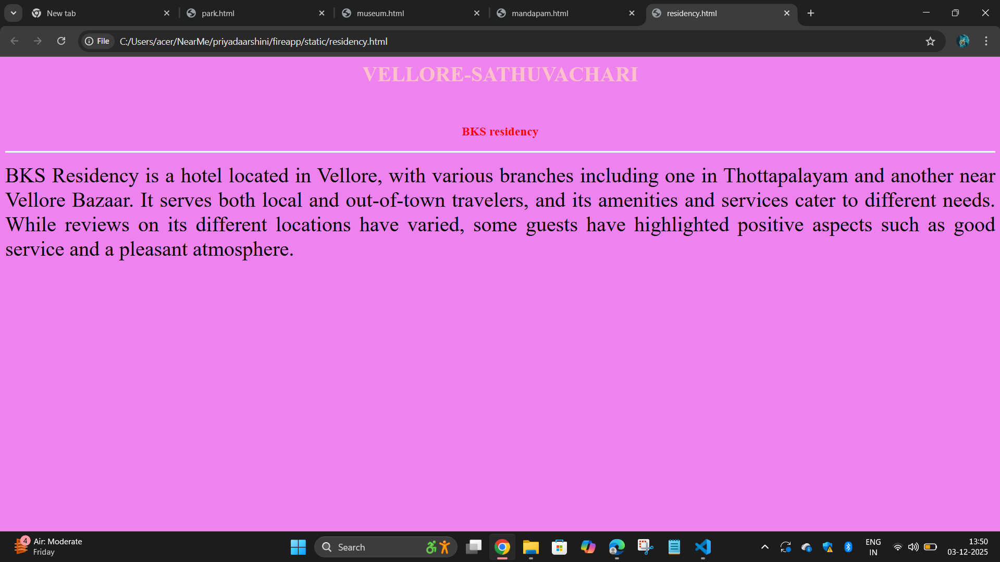
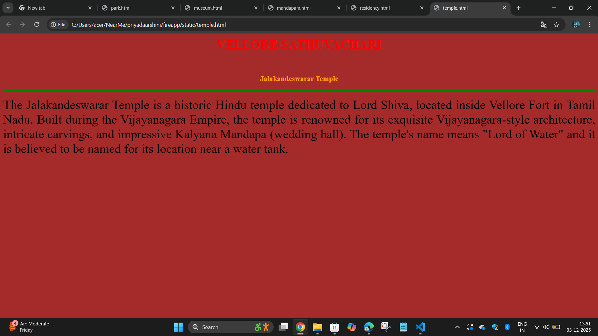

# Ex03 Places Around Me
## Date:03.12.2025

## AIM
To develop a website to display details about the places around my house.

## DESIGN STEPS

### STEP 1
Create a Django admin interface.

### STEP 2
Download your city map from Google as an image.

### STEP 3
Insert the image using `````` tag and link it to the map.

### STEP 4
Using ```<map>``` tag name the map.

### STEP 5
Create clickable regions in the image using ```<area>``` tag.

### STEP 6
Write HTML programs for all the regions identified.

### STEP 7
Execute the programs and publish them.

## CODE
```
fire.html

<html>
    <head>
        <title>NearMe</title>
    </head>
    <body>
        <header>
            <h1 align="center">VELLORE-SATHUVACHARI</h1>
            <br>
            <h4 align="center">PRIYADAARSHINI V -25013541</h4>
        </header>
       

<map name="mycitymap">
    <area target="" alt="periyar park" title="periyar park" href="park.html" coords="1167,535,993,469" shape="rect">
    <area target="" alt="govt.museum" title="govt.museum" href="museum.html" coords="1034,396,1145,371,1252,399,1233,453,1047,460,1020,435" shape="poly">
    <area target="" alt="royal palace mandapam" title="royal palace mandapam" href="mandapam.html" coords="481,303,720,364" shape="rect">
    <area target="" alt="BKS residency" title="BKS residency" href="residency.html" coords="1441,203,80" shape="circle">
    <area target="" alt="jalakandeswarar temple" title="jalakandeswarar temple" href="temple.html" coords="1061,348,1014,310,917,307,853,343,889,410,1014,410,1037,376" shape="poly">
</map>

    </body>
</html>
```
```
park.html

<html>
    <head>
        <title></title>

    </head>
    <body bgcolor="pink">
        <h1 align="center">
            <font color="brown"><b>VELLORE-SATHUVACHARI</b></font>
        </h1>
        <br>
        <h3 align="center">
            <font color="purple"><b>periyar park</b></font>
        </h3>
        <hr size="3" color="white">
        <p align="justify">
            <font size="6">
                Periyar Park in Vellore is a popular public garden known for its lush greenery, walking and roller-skating paths, and children's play area, making it a great spot for family outings and relaxation. Located near the city center, it offers a peaceful escape with amenities like green matting and benches, and has a separate section with a kilometer-long track.
           
         </font>
        </p>
    </body>
</html>
```
```
museum.html

<html>
    <head>
        <title></title>

    </head>
    <body bgcolor="blue">
        <h1 align="center">
            <font color="yellow"><b>VELLORE-SATHUVACHARI</b></font>
        </h1>
        <br>
        <h3 align="center">
            <font color="white"><b>govt.museum</b></font>
        </h3>
        <hr size="3" color="violet">
        <p align="justify">
            <font size="6">
                The Vellore museum is a multi-purpose museum inside Vellore Fort that showcases the history and culture of the region, particularly the North Arcot District. It houses a diverse collection of artifacts across eight galleries, including archaeological finds like stone sculptures and ancient weapons, as well as geological, zoological, and anthropological exhibits. The museum aims to provide knowledge about the area's rich flora, fauna, and cultural heritage.
         </font>
        </p>
    </body>
</html>
```
```
mandapam.html

<html>
    <head>
        <title></title>

    </head>
    <body bgcolor="green">
        <h1 align="center">
            <font color="blue"><b>VELLORE-SATHUVACHARI</b></font>
        </h1>
        <br>
        <h3 align="center">
            <font color="yellow"><b>royal palace mandapam</b></font>
        </h3>
        <hr size="3" color="orange">
        <p align="justify">
            <font size="6">
                Royal Palace Mandapam in Vellore is a large banquet hall located in Krishna Nagar, Konavattam, designed for events like weddings, birthdays, and corporate functions. It can accommodate a large number of guests, offers both seated and floating arrangements, and provides parking facilities. The venue has received a positive rating and offers various customizable packages to suit different events.
         </font>
        </p>
    </body>
</html>
```
```
residency.html

<html>
    <head>
        <title></title>

    </head>
    <body bgcolor="violet">
        <h1 align="center">
            <font color="pink"><b>VELLORE-SATHUVACHARI</b></font>
        </h1>
        <br>
        <h3 align="center">
            <font color="red"><b>BKS residency</b></font>
        </h3>
        <hr size="3" color="white">
        <p align="justify">
            <font size="6">
                BKS Residency is a hotel located in Vellore, with various branches including one in Thottapalayam and another near Vellore Bazaar. It serves both local and out-of-town travelers, and its amenities and services cater to different needs. While reviews on its different locations have varied, some guests have highlighted positive aspects such as good service and a pleasant atmosphere.
         </font>
        </p>
    </body>
</html>
```
```
temple.html

<html>
    <head>
        <title></title>

    </head>
    <body bgcolor="brown">
        <h1 align="center">
            <font color="red"><b>VELLORE-SATHUVACHARI</b></font>
        </h1>
        <br>
        <h3 align="center">
            <font color="orange"><b>jalakandeswarar temple</b></font>
        </h3>
        <hr size="3" color="green">
        <p align="justify">
            <font size="6">
                The Jalakandeswarar Temple is a historic Hindu temple dedicated to Lord Shiva, located inside Vellore Fort in Tamil Nadu. Built during the Vijayanagara Empire, the temple is renowned for its exquisite Vijayanagara-style architecture, intricate carvings, and impressive Kalyana Mandapa (wedding hall). The temple's name means "Lord of Water" and it is believed to be named for its location near a water tank.
         </font>
        </p>
    </body>
</html>
```

## OUTPUT







## RESULT
The program for implementing image maps using HTML is executed successfully.
